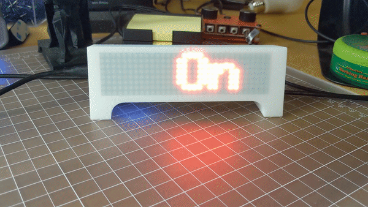

# onACall

## Hardware
- WeMos D1 ESP8266 arduino board
	- https://www.amazon.com/gp/product/B01N8RLF8L
- LED Dot Matrix (max7219)
	- https://www.amazon.com/HiLetgo-MAX7219-Arduino-Microcontroller-Display/dp/B07FFV537V
- LED 7219 case (optional 3D print)
	- https://www.thingiverse.com/thing:2867294

## Setup
1. Upload onACall.ino file onto ESP board
2. Connect ESP board to LED Matrix
	- Wire Config:
		- VCC -> 5v
		- GND -> G
		- DIN -> D7
		- CS -> D6
		- CLK -> D5
3. Plug in micro usb cable to power the ESP board
	- Insert hardware into case (optional step)
4. When LED Matrix boots up capture the IP Address
	- Update bash script var `ESP_IP` with the IP Address
	- when the ESP code is ready it will display the ready state message of "hi"
5. Run bash script `sh path/to/file/Arduino/OnACall.sh`

### Notes
- You can change which program(s) you are listening for with the `PROGRAM` variable in the bash script. Programs are pipe delimited "|"
	- defaulted to BlueJeans and Zoom
- The ESP board has routes that can be utilized through the browser to manually control the state
	- `<IPAddress>/onACall` - will display the "On A Call..." scroll message
	- `<IPAddress>/offACall` - will display the "done" message and return the the "hi" or ready state